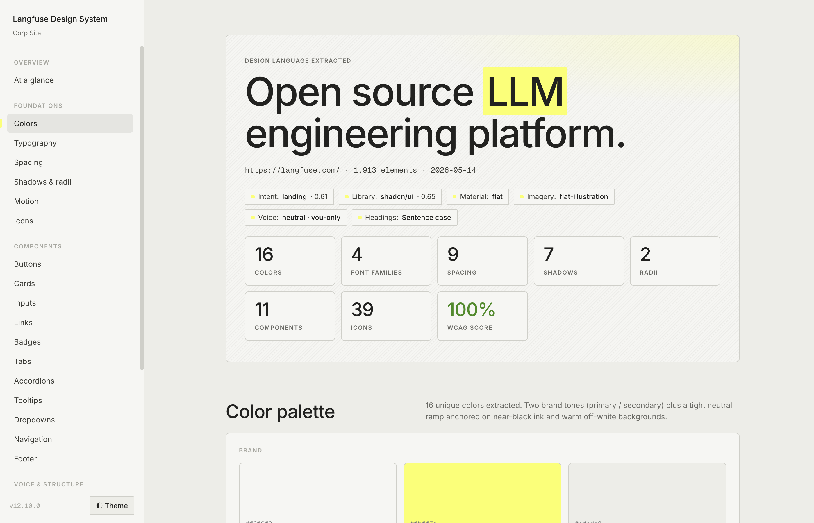
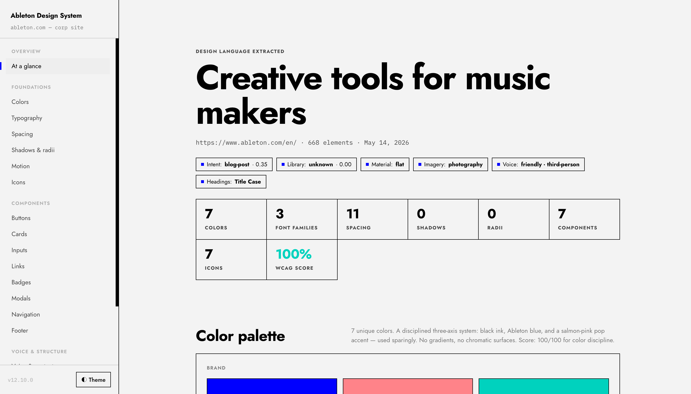
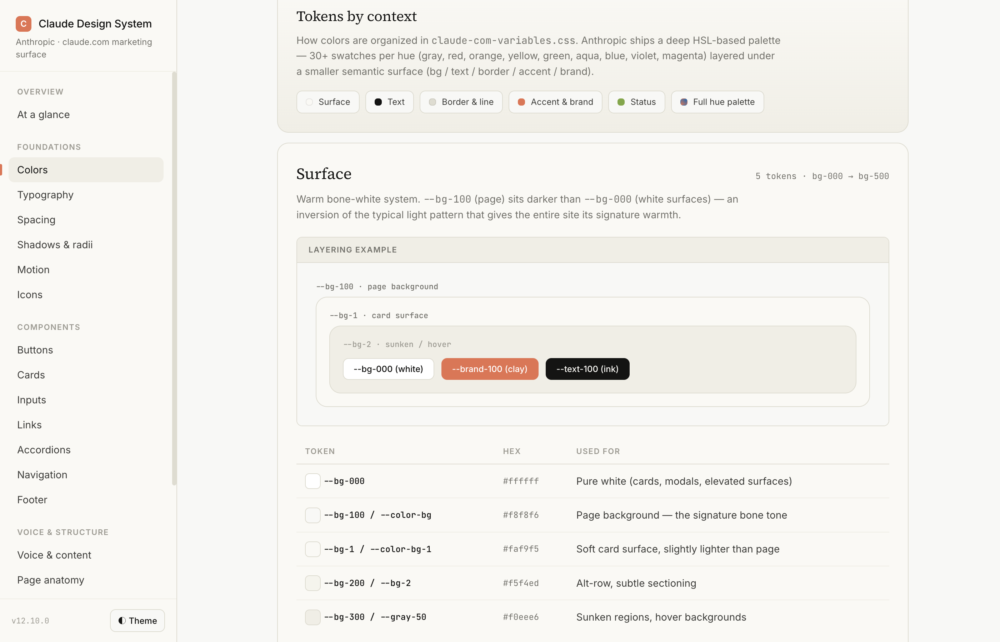
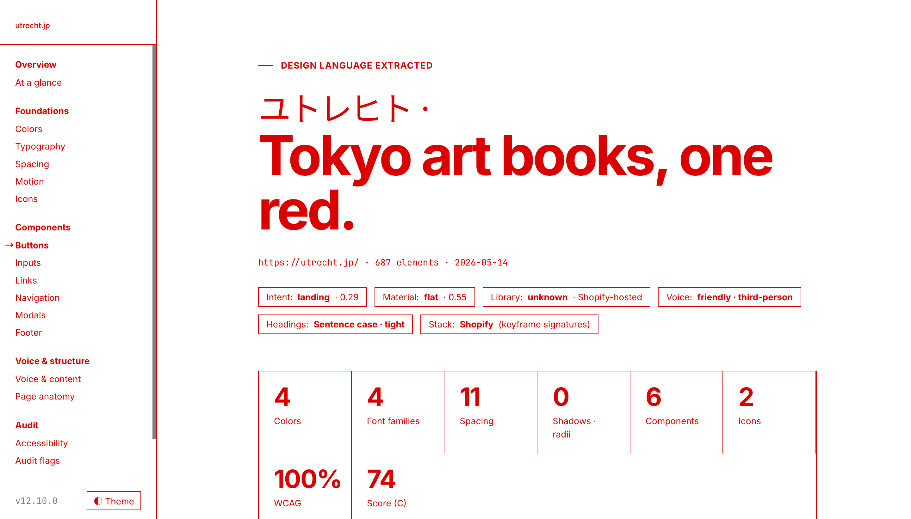
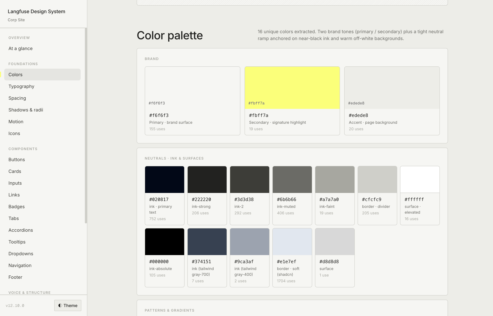
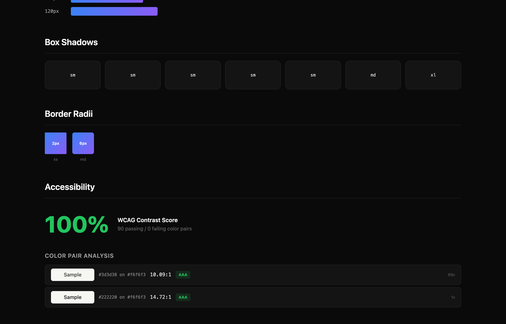

A Claude Code skill built on top of [`designlang`](https://www.npmjs.com/package/designlang) that turns any website URL into a polished, self-referential design system page.

**Two additional outputs:**
+ An HTML design system page styled with the extracted tokens
+ A `DESIGN.md` file cataloguing every detected token & and pattern 

---

### Live demos

<table>
<tr>
<td width="25%" align="center"><a href="https://nmtrang29.github.io/extract-design-system/examples/langfuse/langfuse-design-system.html"><b>▶ Langfuse</b></a></td>
  <td width="25%" align="center"><a href="https://nmtrang29.github.io/extract-design-system/examples/ableton/ableton-design-system.html"><b>▶ Ableton</b></a></td>
<td width="25%" align="center"><a href="https://nmtrang29.github.io/extract-design-system/examples/claude/claude-design-system.html"><b>▶ Claude</b></a></td>
<td width="25%" align="center"><a href="https://nmtrang29.github.io/extract-design-system/examples/utrecht/utrecht-design-system.html"><b>▶ Utrecht</b></a></td>
</tr>
<tr>
<td><a href="https://nmtrang29.github.io/extract-design-system/examples/langfuse/langfuse-design-system.html"></a></td>
<td><a href="https://nmtrang29.github.io/extract-design-system/examples/ableton/ableton-design-system.html"></a></td>
<td><a href="https://nmtrang29.github.io/extract-design-system/examples/claude/claude-design-system.html"></a></td>
<td><a href="https://nmtrang29.github.io/extract-design-system/examples/utrecht/utrecht-design-system.html"></a></td>
</tr>
</table>

---

### Installation

Prerequisite [`designlang`](https://www.npmjs.com/package/designlang) `npm i -g designlang` 


In Claude Code (native plugin)

```
/plugin install nmtrang29/extract-design-system
```

Verify by typing `/extract-design-system`

---

### Usage

```bash
/extract-design-system https://yoursite.com/
```

This will:

1. Run `npx designlang <url> --screenshots` to produce the raw extraction artifacts into a per-site folder
2. Read every relevant artifact (`*-variables.css`, `*-design-tokens.json`, `*-intent.json`, `*-voice.json`, `*-anatomy.tsx`, `*-icon-system.json`, `*-visual-dna.json`, etc.)
3. Read `SKILL.md`, follows the process, references `BUILD.md` for detailed rules, populates `TEMPLATE.html` with the extracted values.
4. Save the page at `./design-extract-output/<site>/<site>-design-system.html`
5. Write a comprehensive `DESIGN.md` 

---

### What's new?

#### Page styling

On brand. The page chrome is built from the same tokens it documents. Fixed left sidebar with scrollspy. Mobile collapses to hamburger drawer.

<table>
<tr><td width="50%" align="center"><sub><b>Before</b></sub></td><td width="50%" align="center"><sub><b>After</b></sub></td></tr>
<tr>
<td></td>
<td></td>
</tr>
</table>

#### Colors

Two-layer view: primitive palette + tokens shown in context. Each with live examples + reference table.

<table> 
<tr><td width="50%" align="center"><sub><b>Before</b></sub></td><td width="50%" align="center"><sub><b>After</b></sub></td></tr>
<tr>
<td></td>
<td></td>
</tr>
</table>

#### Components

Render *every* detected pattern with live examples that use the actual extracted tokens, not just the canonical 3.

<table>
<tr><td width="50%" align="center"><sub><b>Before</b></sub></td><td width="50%" align="center"><sub><b>After</b></sub></td></tr>
<tr>
<td></td>
<td></td>
</tr>
</table>

#### Icons

Real rendered SVGs (Adapters for Lucide, Heroicons / Octicons / Material Symbols / Bootstrap / Tabler / Phosphor / Feather / Carbon / Spectrum / SLDS / Radix / Ant). Repeated icons get a usage-count badge.

<table>
<tr><td width="50%" align="center"><sub><b>Before</b></sub></td><td width="50%" align="center"><sub><b>After</b></sub></td></tr>
<tr>
<td></td>
<td></td>
</tr>
</table>

#### Typography

Each type-scale row labels which font is used (display vs body vs UI vs code).

<table>
<tr><td width="50%" align="center"><sub><b>Before</b></sub></td><td width="50%" align="center"><sub><b>After</b></sub></td></tr>
<tr>
<td></td>
<td></td>
</tr>
</table>

### Other changes
+ Token-name pattern match broadening. Plus a tiebreaker that prefers DOM-observed colors when named tokens disagree with what's painted. 
+ Pattern catalogue 11 → 33** — adds toasts, data tables, pagination, switches, sliders, avatars, breadcrumbs, modals, drawers, skeletons, empty states, steppers, date pickers, color pickers, etc.
+ Default theme matches the source site, not Claude's preference. 

---

### Baked-in decisions

Choices that make the output a coherent design-system page:

- **Sidebar:** fixed left, 248px, scrollspy active highlight, hamburger on mobile
- **Default theme:** matches the source site's detected default
- **Pattern depth:** render every detected component pattern with live examples (not a fixed list)
- **Colors:** primitive palette + tokens-by-context across role groups
- **Icons:** real rendered SVGs from whatever library is detected
- **Type scale:** show font family per row (inferred from family usage counts)
- **Radii:** snap every chrome radius to the detected
- **Typography:** snap to detected scale
- **Accent treatment:** decide by luminance — near-white accents → background pill, saturated accents → text color directly
- **Per-site folders:** outputs never mix between extractions

See [`SKILL.md`](skills/extract-design-system/SKILL.md) for the full list.


## Known limitations

- Custom display fonts (e.g., f37 Analog, GT America, Söhne...) aren't auto-loaded. 
- Design-system docs sites currently produce confused output.
