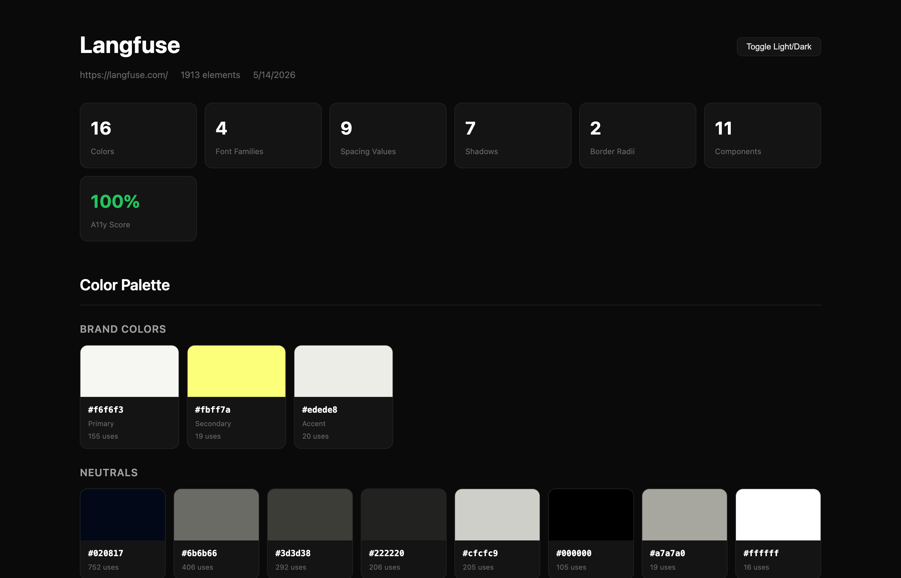

# extract-design-system

A **Claude Code skill** that turns any website URL into a polished, self-referential design-system reference. Built on top of [`designlang`](https://www.npmjs.com/package/designlang) and produces two outputs:
  + a single-file HTML review styled with the extracted tokens
  + `DESIGN.md` cataloguing every detected token, heading, weight, breakpoint, and pattern)

<table>
<tr>
<td width="50%" align="center"><sub><b>Langfuse</b> — warm beige · yellow accent · shadcn/ui</sub></td>
<td width="50%" align="center"><sub><b>Claude</b> — warm bone · Source Serif · clay-orange · Tailwind</sub></td>
</tr>
<tr>
<td></td>
<td></td>
</tr>
</table>

---

## Installation

**Prerequisite:** [`designlang`](https://www.npmjs.com/package/designlang) (`npm i -g designlang`, or use via `npx` on first run).

In Claude Code, run:


```
/plugin install nmtrang29/extract-design-system
```


Claude Code reads `.claude-plugin/plugin.json` from this repo and registers the skill under `~/.claude/skills/extract-design-system/`. Verify by typing `/extract-design-system`

---

## Usage

```bash
/extract-design-system https://yoursite.com/
```

This will:

1. Run `npx designlang <url> --screenshots` to produce 22 raw extraction artifacts
2. Read every relevant artifact (`*-variables.css`, `*-design-tokens.json`, `*-intent.json`, `*-voice.json`, etc.)
3. Populate `skills/extract-design-system/TEMPLATE.html` with the extracted values
4. Generate a design system preview: `./design-extract-output/<site>/<site>-design-system.html` 
5. Write a comprehensive `DESIGN.md` (400–800 lines) into the same folder with every detected token, heading, weight, breakpoint, and pattern. Any inferred mappings or font fallbacks are noted inline.

---

## What's different from [design-extract](https://github.com/Manavarya09/design-extract)

### Page styling

Self-referential. The page chrome (background, borders, radii, type scale, mono font, accent treatment) is built from the *same tokens* it documents.

<table>
<tr><td width="50%" align="center"><sub><b>Before</b></sub></td><td width="50%" align="center"><sub><b>After</b></sub></td></tr>
<tr>
<td></td>
<td></td>
</tr>
</table>

### Colors

Two-layer view: primitive palette **+** tokens shown in context (surface, text, border, status…each with live examples + reference table).

<table>
<tr><td width="50%" align="center"><sub><b>Before</b></sub></td><td width="50%" align="center"><sub><b>After</b></sub></td></tr>
<tr>
<td></td>
<td></td>
</tr>
</table>

### Nav

Fixed left sidebar. Active section highlighted. Mobile collapses to hamburger drawer.

<table>
<tr><td width="50%" align="center"><sub><b>Before</b></sub></td><td width="50%" align="center"><sub><b>After</b></sub></td></tr>
<tr>
<td></td>
<td></td>
</tr>
</table>

### Icons

Repeated icons get a usage-count badge. Moved into the Foundations group.

<table>
<tr><td width="50%" align="center"><sub><b>Before</b></sub></td><td width="50%" align="center"><sub><b>After</b></sub></td></tr>
<tr>
<td></td>
<td></td>
</tr>
</table>

### Components

Render *every* detected pattern, not just the 3 canonical ones.

<table>
<tr><td width="50%" align="center"><sub><b>Before</b></sub></td><td width="50%" align="center"><sub><b>After</b></sub></td></tr>
<tr>
<td></td>
<td></td>
</tr>
</table>

### Typography

Each type-scale row labels which font is used (display vs body vs UI vs code).

<table>
<tr><td width="50%" align="center"><sub><b>Before</b></sub></td><td width="50%" align="center"><sub><b>After</b></sub></td></tr>
<tr>
<td></td>
<td></td>
</tr>
</table>

### Theme

Default theme matches the source site, not Claude's preference.

<table>
<tr><td width="50%" align="center"><sub><b>Before</b></sub></td><td width="50%" align="center"><sub><b>After</b></sub></td></tr>
<tr>
<td></td>
<td></td>
</tr>
</table>

---

## How it works

The skill is composed of three files in `skills/extract-design-system/`:

| File | Role |
|---|---|
| [`SKILL.md`](skills/extract-design-system/SKILL.md) | Entry point. |
| [`BUILD.md`](skills/extract-design-system/BUILD.md) | Detailed page-structure spec. Section-by-section content, token mapping table, snapping rules. |
| [`TEMPLATE.html`](skills/extract-design-system/TEMPLATE.html) | Pre-built HTML scaffold|

Claude reads `SKILL.md`, follows the process, references `BUILD.md` for detailed rules, and populates `TEMPLATE.html` with the extracted values.

---

## Locked-in choices 

These are decisions baked into the skill. Make changes as needed.

- **Sidebar**: fixed left, 248px, scrollspy active highlight, hamburger on mobile
- **Default theme**: matches the source site
- **Pattern depth**: render every detected component pattern with live examples
- **Colors**: primitive palette + tokens-by-context 
- **Icons**: real SVGs, with usage counts
- **Type scale**: show font family per row
- **Radii**: snap to the detected scale
- **Typography**: snap to the detected scale

See [`SKILL.md`](skills/extract-design-system/SKILL.md) for the full list.

---

## Known limitations

- **Custom display fonts** (e.g., f37 Analog, GT America) aren't auto-loaded. Headings fall back to the primary body face. 

---

## Credits

- Built on top of [`designlang`](https://www.npmjs.com/package/designlang) by [Manavarya09](https://github.com/Manavarya09/design-extract) the upstream extractor that produces the 22 raw artifacts this skill reads.
- Colors-by-context layout inspired by [IBM Carbon Design System](https://carbondesignsystem.com/elements/color/overview/).
