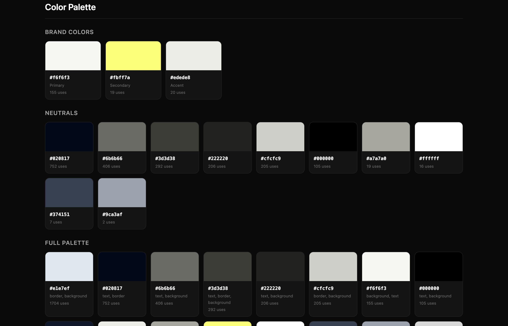
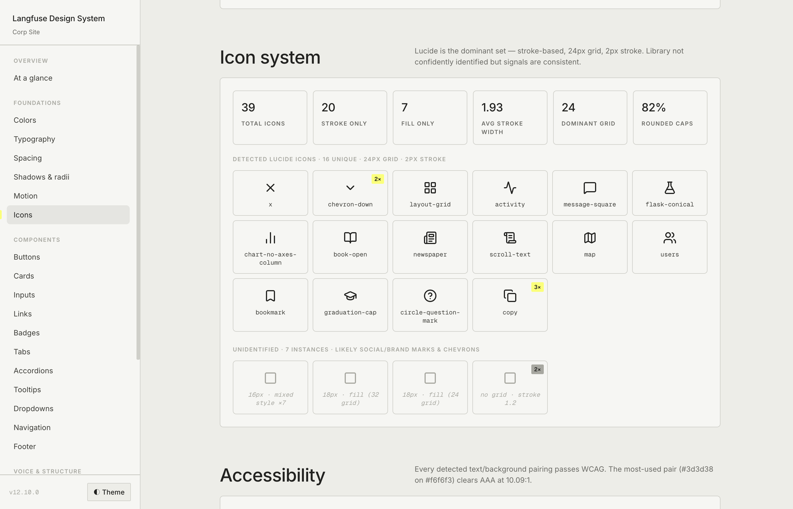
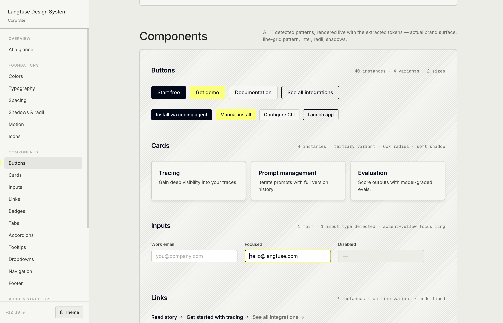
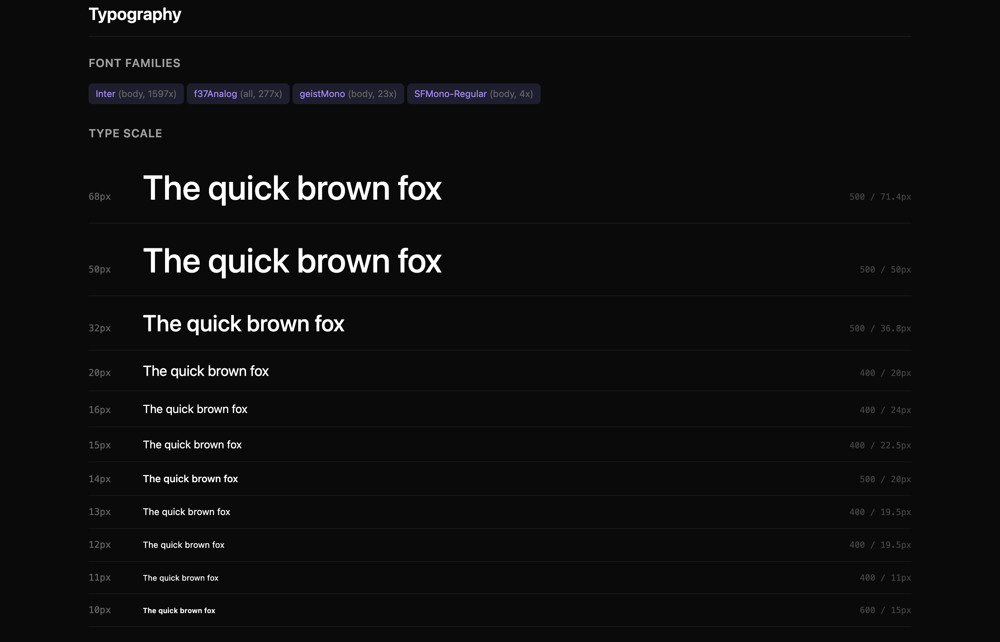
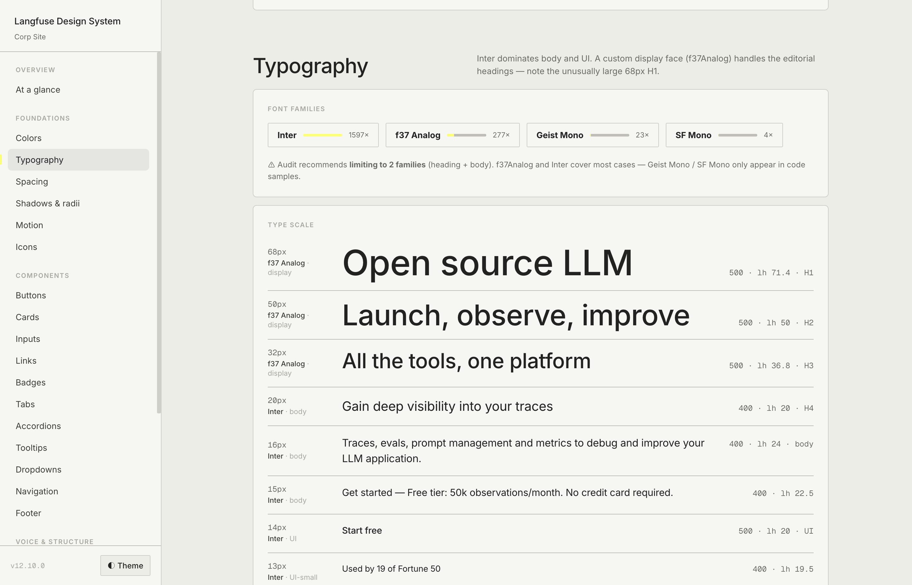

# extract-design-system

A fork of [design-extract](https://github.com/Manavarya09/design-extract) that turns the raw extraction output into a **polished, self-referential design system**.


[**▶ Live example**](examples/langfuse/langfuse-design-system.html)

---

### What's different from [design-extract](https://github.com/Manavarya09/design-extract)

| Topic | Change | Before | After |
|---|---|---|---|
| **Page styling** | Self-referential. The page chrome (background, borders, radii, type scale, mono font, accent treatment) is built from the *same tokens* it documents. |  |  |
| **Colors** | Two-layer view: primitive palette **+** tokens shown in context (surface, text, border, status...each with live examples + reference table). |  |  |
| **Nav** | Fixed left sidebar. Active section highlighted. Mobile collapses to hamburger drawer.|  |  |
| **Icons** | Repeated icons get a usage-count badge. Moved into the Foundations group.|  |  |
| **Components** | Render *every* detected pattern, not just the 3 canonical ones. |  |  |
| **Typography** | Each type-scale row labels which font is used (display vs body vs UI vs code). |  |  |
| **Theme** | Default theme matches the source site, not Claude's preference. |  |  |

---

## Installation

This is a Claude Code skill. Symlink it into your Claude config:

```bash
git clone https://github.com/nmtrang29/extract-design-system.git
cd extract-design-system
ln -s "$(pwd)/skills/extract-design-system" ~/.claude/skills/extract-design-system
```

Verify by typing `/extract-design-system` in Claude Code — the skill should appear in the available list.

**Prerequisites:**

- [`designlang`](https://www.npmjs.com/package/designlang) (`npm i -g designlang`, or use via `npx`)

---

## Usage

```bash
# In Claude Code
/extract-design-system https://yoursite.com/
```

This will:

1. Run `npx designlang <url> --screenshots` to produce 22 raw extraction artifacts
2. Read every relevant artifact (`*-variables.css`, `*-design-tokens.json`, `*-intent.json`, `*-voice.json`, etc.)
3. Populate `skills/extract-design-system/TEMPLATE.html` with the extracted values
4. Save the result inside a per-site folder: `./design-extract-output/<site>/<site>-design-system.html` (e.g. `./design-extract-output/langfuse/langfuse-design-system.html`)
5. Optionally write a `CHANGELOG.md` documenting any inferred mappings or fallbacks

---

## Output

Each website gets its own folder so artifacts from different runs never mix:

```
design-extract-output/
├── langfuse/
│   ├── langfuse-design-system.html   ← the polished design-system page (what this skill adds)
│   ├── langfuse-com-preview.html     ← the basic preview from designlang (left in place)
│   ├── langfuse-com-DESIGN.md
│   ├── langfuse-com-design-tokens.json
│   ├── langfuse-com-variables.css    ← richest semantic-token source
│   ├── langfuse-com-intent.json
│   ├── langfuse-com-voice.json
│   ├── langfuse-com-anatomy.tsx
│   ├── langfuse-com-icon-system.json
│   ├── ... (13 more designlang artifacts)
│   └── CHANGELOG.md                  ← optional provenance log
├── vercel/                           ← next site you run on
│   └── ...
└── shopify/
    └── ...
```

Folder name = brand only, no TLD (`langfuse.com → langfuse/`, `vercel.com → vercel/`).

---

## How it works

The skill is composed of three files in `skills/extract-design-system/`:

| File | Role |
|---|---|
| [`SKILL.md`](skills/extract-design-system/SKILL.md) | Entry point. Defines the process, core decisions, and trigger phrases. |
| [`BUILD.md`](skills/extract-design-system/BUILD.md) | Detailed page-structure spec. Section-by-section content, token mapping table, snapping rules. |
| [`TEMPLATE.html`](skills/extract-design-system/TEMPLATE.html) | Pre-built HTML scaffold|

Claude reads `SKILL.md`, follows the process, references `BUILD.md` for detailed rules, and populates `TEMPLATE.html` with the extracted values — instead of regenerating 2000+ lines of HTML from natural-language instructions every run.

---

## Locked-in choices 

These are decisions baked into the skill. Make changes as needed.

- **Sidebar**: fixed left, 248px, scrollspy active highlight, hamburger on mobile
- **Default theme**: matches the source site
- **Pattern depth**: render every detected component pattern with live examples
- **Colors**: primitive palette + tokens-by-context 
- **Icons**: real SVGs, with usage counts
- **Type scale**: show font family per row
- **Radii**: snap to the detected scale
- **Typography**: snap to the detected scale

See [`SKILL.md`](skills/extract-design-system/SKILL.md) for the full list.

---

## Known limitations

- **Custom display fonts** (e.g., f37 Analog, GT America) aren't auto-loaded. Headings fall back to the primary body face. 

---

## Credits

- Forked from [Manavarya09/design-extract](https://github.com/Manavarya09/design-extract) — the underlying `designlang` extractor.
- Colors-by-context layout inspired by [IBM Carbon Design System](https://carbondesignsystem.com/elements/color/overview/).
