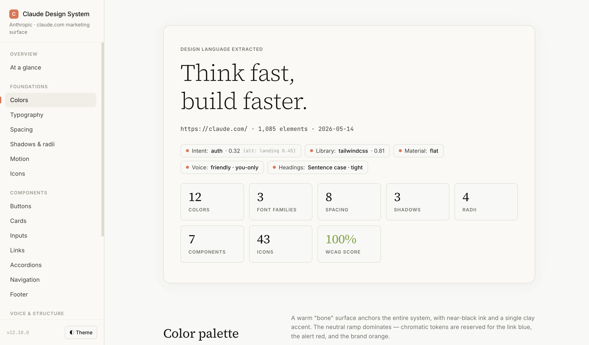
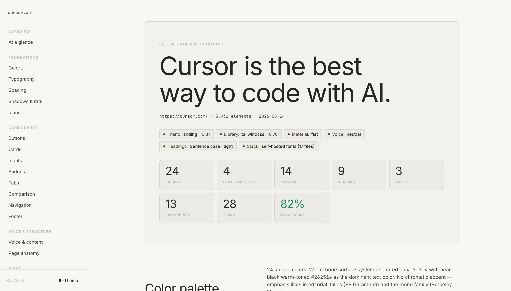
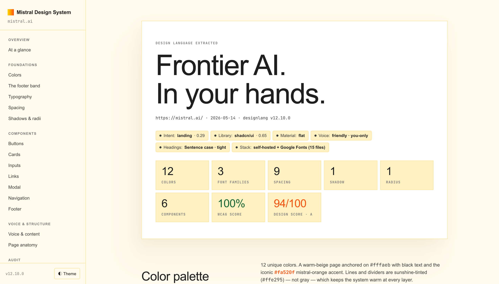

## Extract Design System

A Claude Code wrapper that turns any URL into a truthful, self-referential design system.

---

### Problem

Issues I encounter with a couple of DESIGN.md / extraction tools 

1. **No visual fidelity**: Design system preview doesn’t reflect the original brand, tokens, or patterns. Making it hard to visualise unless you're familiar with the source.  
2. **Token ≠ reality**: Real usage sometimes diverges from detected values  

---

### Principle: Count what is painted

- Compare the most-painted value per role to the named token  
- Prefer the painted value when they differ  
- Log both in `DESIGN.md` for auditability  
- Role tiebreakers live in [`BUILD.md`](skills/extract-design-system/BUILD.md) and rely on extraction evidence (not hardcoded rules)

→ See [`SKILL.md`](skills/extract-design-system/SKILL.md) for full details


**Main Outputs**
- An HTML design system page 
- A `DESIGN.md` documenting patterns, tokens, and rules for coding agents

#### Live demos

<table>
<tr>
<td width="16%" align="center"><sub><a href="https://nmtrang29.github.io/extract-design-system/examples/langfuse/langfuse-design-system.html">▶ Langfuse</a></sub></td>
<td width="16%" align="center"><sub><a href="https://nmtrang29.github.io/extract-design-system/examples/ableton/ableton-design-system.html">▶ Ableton</a></sub></td>
<td width="16%" align="center"><sub><a href="https://nmtrang29.github.io/extract-design-system/examples/claude/claude-design-system.html">▶ Claude</a></sub></td>
<td width="16%" align="center"><sub><a href="https://nmtrang29.github.io/extract-design-system/examples/utrecht/utrecht-design-system.html">▶ Utrecht</a></sub></td>
<td width="16%" align="center"><sub><a href="https://nmtrang29.github.io/extract-design-system/examples/cursor/cursor-design-system.html">▶ Cursor</a></sub></td>
<td width="16%" align="center"><sub><a href="https://nmtrang29.github.io/extract-design-system/examples/mistral/mistral-design-system.html">▶ Mistral</a></sub></td>
</tr>
<tr>
<td><a href="https://nmtrang29.github.io/extract-design-system/examples/langfuse/langfuse-design-system.html"></a></td>
<td><a href="https://nmtrang29.github.io/extract-design-system/examples/ableton/ableton-design-system.html"></a></td>
<td><a href="https://nmtrang29.github.io/extract-design-system/examples/claude/claude-design-system.html"></a></td>
<td><a href="https://nmtrang29.github.io/extract-design-system/examples/utrecht/utrecht-design-system.html"></a></td>
<td><a href="https://nmtrang29.github.io/extract-design-system/examples/cursor/cursor-design-system.html"></a></td>
<td><a href="https://nmtrang29.github.io/extract-design-system/examples/mistral/mistral-design-system.html"></a></td>
</tr>
</table>
  
---

### Installation
Install designlang
```
npm i designlang
```

In Claude Code

```
/plugin install nmtrang29/extract-design-system
```

Verify by typing `/extract-design-system`

---

### Usage

```bash
/extract-design-system https://yoursite.com/
```

This will:

1. Run `npx designlang <url> --screenshots` to produce the raw extraction artifacts into a per-site folder
2. Read every relevant artifact (`*-variables.css`, `*-design-tokens.json`, `*-intent.json`, `*-voice.json`, `*-anatomy.tsx`, `*-icon-system.json`, `*-visual-dna.json`, etc.)
3. Read `SKILL.md`, follows the process, references `BUILD.md` for detailed rules, populates `TEMPLATE.html` with the extracted values.
4. Save the page at `./design-extract-output/<site>/<site>-design-system.html`
5. Write a comprehensive `DESIGN.md`

Want inspirations of websites that are less generic? Browse some here

- https://brutalistwebsites.com/
- https://www.siteinspire.com/


---

### What's new?

#### Page styling

On brand. Content taken from the source site. The page chrome is built from the same tokens it documents. Fixed left sidebar with scrollspy. Mobile collapses to hamburger drawer.

<table>
<tr><td width="50%" align="center"><sub><b>Before</b></sub></td><td width="50%" align="center"><sub><b>After</b></sub></td></tr>
<tr>
<td></td>
<td></td>
</tr>
</table>

#### Colors

Two-layer view: primitive palette + tokens shown in context. Each with live examples + reference table. Token-name pattern match broadening. Plus a tiebreaker that prefers DOM-observed colors when named tokens disagree with what's painted. 

<table> 
<tr><td width="50%" align="center"><sub><b>Before</b></sub></td><td width="50%" align="center"><sub><b>After</b></sub></td></tr>
<tr>
<td></td>
<td></td>
</tr>
</table>

#### Components

Render *every* detected pattern with live examples that use the actual extracted tokens, not just the canonical 3. Pattern catalogue 11 → 33 — adds toasts, data tables, pagination, switches, sliders, avatars, breadcrumbs, modals, drawers, skeletons, empty states, steppers, date pickers, color pickers, etc.

<table>
<tr><td width="50%" align="center"><sub><b>Before</b></sub></td><td width="50%" align="center"><sub><b>After</b></sub></td></tr>
<tr>
<td></td>
<td></td>
</tr>
</table>

#### Icons

Real rendered SVGs (Adapters for Lucide, Heroicons / Octicons / Material Symbols / Bootstrap / Tabler / Phosphor / Feather / Carbon / Spectrum / SLDS / Radix / Ant). Repeated icons get a usage-count badge.

<table>
<tr><td width="50%" align="center"><sub><b>Before</b></sub></td><td width="50%" align="center"><sub><b>After</b></sub></td></tr>
<tr>
<td></td>
<td></td>
</tr>
</table>

#### Typography

Each type-scale row labels which font is used (display vs body vs UI vs code).

<table>
<tr><td width="50%" align="center"><sub><b>Before</b></sub></td><td width="50%" align="center"><sub><b>After</b></sub></td></tr>
<tr>
<td></td>
<td></td>
</tr>
</table>


#### Known limitations

- Custom display fonts (e.g., f37 Analog, GT America, Söhne...) aren't auto-loaded. 
- Design-system docs sites currently produce confused output.

---

#### Additional inspirations if you want websites that don’t feel like another SaaS landing page

- https://brutalistwebsites.com/
- https://www.siteinspire.com/
- https://www.awwwards.com/websites/experimental
- https://theindex.website/
